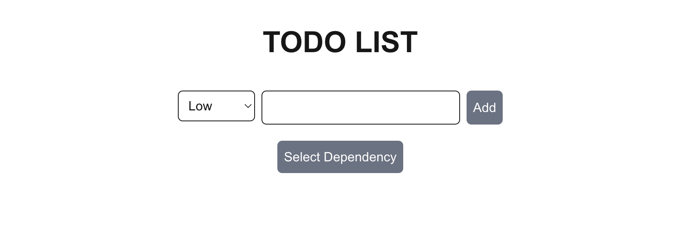
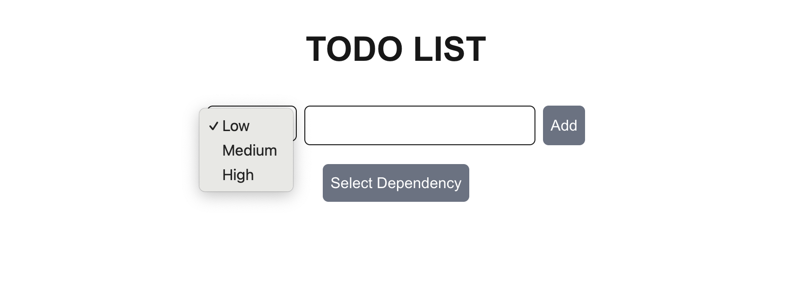
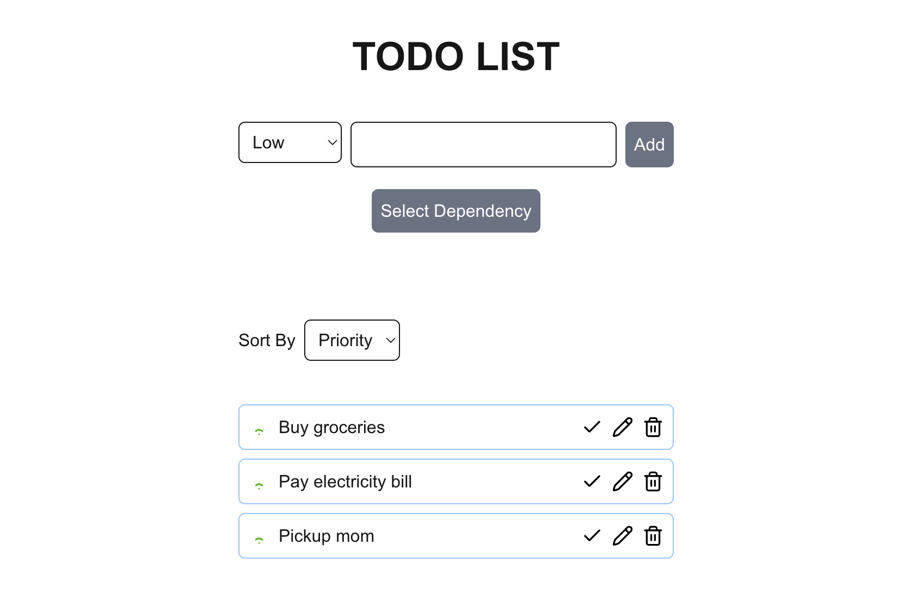
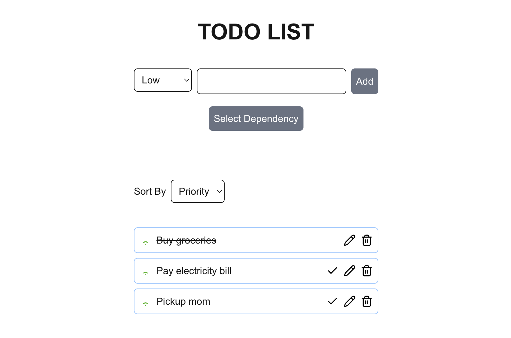
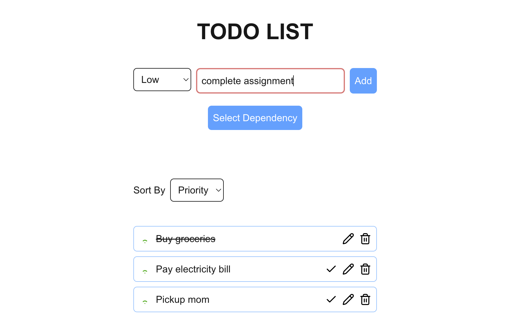
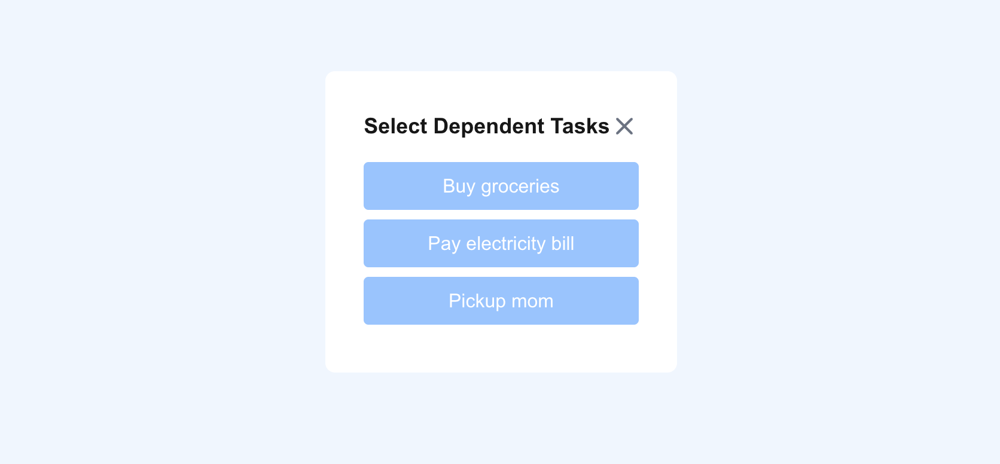
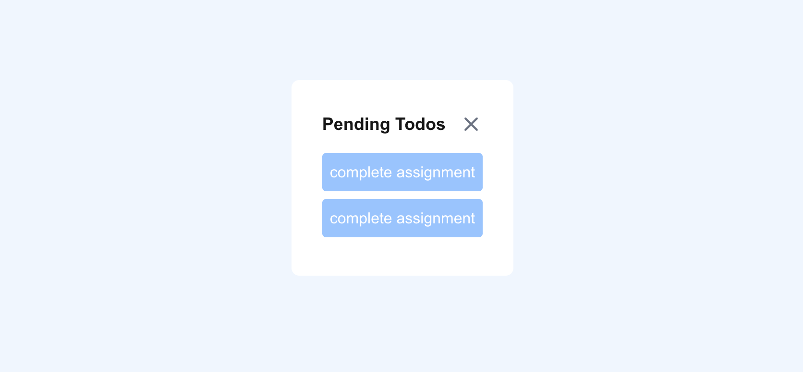
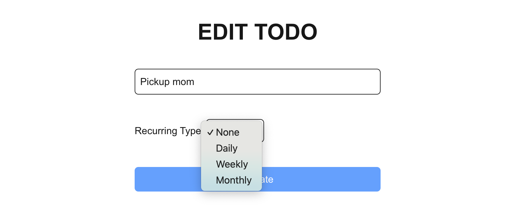
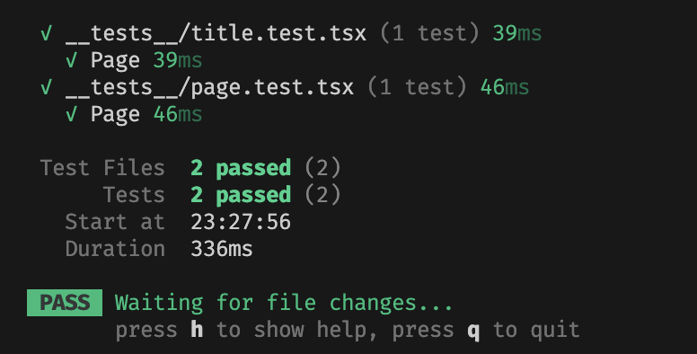

# TODO APP

## Running the application

Follow the steps to run the application

1. git clone git@github.com:deluxanMD/todo-app.git
2. cd todo-app
3. npm install
4. npm run dev
5. open `localhost:3000` and click "click me" link or directly open `localhost:3000/todo`

This is a todo app developed based on NextJS, Redux Toolkit, Tailwind CSS. This app contains the following features.

1. Add Todo
2. List Todos
3. Mark Todo as completed
4. Edit Todo
5. Make a Todo dependent to another Todo
6. Delete Todo
7. Add Recurring Todo

## Add Todo

User needs to navigate to `/todo` link from the main link to land on the Todo app. In this page the user can see dropdown to select priority (low, medium, high) and an input to enter the todo title and a button to add todo. Initially the button is disabled once user type in the input field the button gets enabled.

### Screenshots

## List Todos

When user adds todo it will be added to the global state and the added todos will be retrieved in this page as a list view. Each list contains a wifi icon in the beginning which denotes the priority of the todo follows by the title of the todo. At the end of the list there are 3 icons used for check completed, edit todo and delete todo respectively.

### Check Completed

Once we click the check icon the status of the todo gets updated in the global state and in the UI it will be displayed as a ~~strikethrough~~

### Edit Todo

Once we click edit icon it will be redirected to the edit page (`/todo/:id`). It will filter the todo based on the id from the url and displays the information in the edit form. from here user can able to edit the title and click the "Update" button to edit the title.

### Screenshots

## Dependent Todo

User can make a todo dependent to another todo so that the todo which has dependent todos cannot be marked as completed and also cannot be deleted until the dependent todos are marked as completed. To achieve this first we need to enter the todo title and before adding the todo we need to click Select Dependency button.

This will bring all the available todos as a list inside a modal. From there user can select/unselect the dependency todos. And clicking close icon will close the modal.

## Delete Todo

Once user clicks the delete icon it will check whether the todo has dependent todos or not. If not it will delete the todo. If yes it will display the pending todos (dependent todos) which needed to be completed.

## Recurring Todos

In the edit page there is a dropdown where user can select (none, daily, weekly, monthly). Based on the selection the todo will be created automatically. But this is purely running on frontend the tab needs to be opened.

## Unit Test

I have added some unit tests. To check the tests run correctly we can run the command `npm run test`

